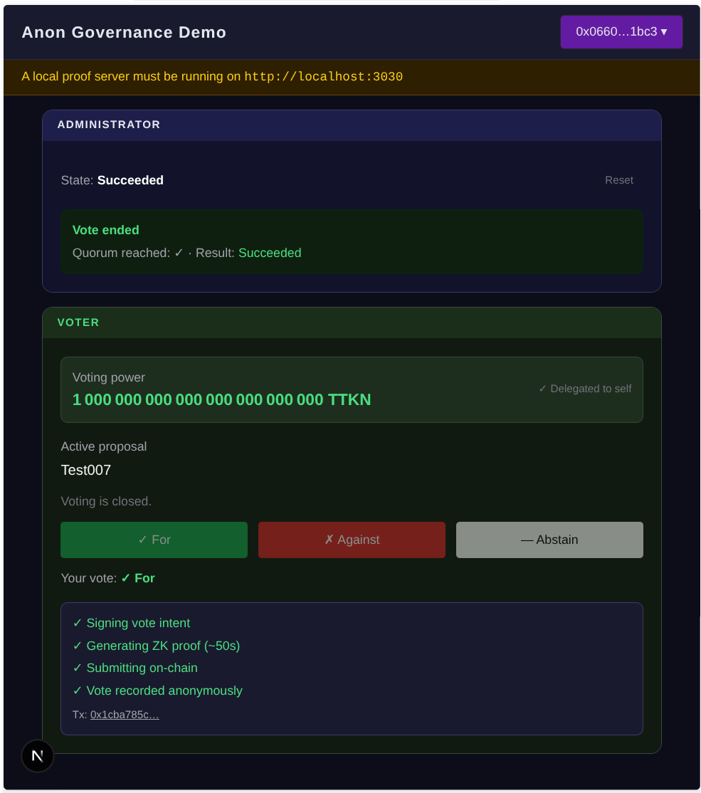

# ERC20 Anonymous Governance DApp

A demo DApp that demonstrates **fully anonymous on-chain voting** via [SNIP-36 — In-Protocol Proof Verification](https://community.starknet.io/t/snip-36-in-protocol-proof-verification/116123) on Starknet Mainnet.

Voters cast governance votes without revealing their identity or their choice on-chain. The contract only records a nullifier and a vote weight — never who voted nor which side they chose.



> **Status:** Experimental / research. `GovernorCountingAnonymousComponent` is not audited.

---

## Part 1 — Using the DApp

### Prerequisites

| Requirement | Details |
|---|---|
| Starknet wallet | Argent X or Braavos connected to **Starknet Mainnet** |
| Proof server API key | A SNIP-36 Prover Gateway API key (`PROOF_SERVER_API_KEY`) |
| Backend account | A Mainnet account address + private key, funded with STRK |
| Node.js | v20+ |

> Proof generation runs on the remote SNIP-36 Prover Gateway and takes **40–50 seconds** per proof. No local hardware requirements.

### Setup

1. **Clone and install**

   ```bash
   git clone https://github.com/PhilippeR26/ERC20-anonym-governance-DAPP
   cd ERC20-anonym-governance-DAPP
   npm install
   ```

2. **Configure environment variables** — copy `.env.local.example` to `.env.local` and fill in:

   ```env
   # Public — exposed to the browser
   NEXT_PUBLIC_GOVERNOR_ADDRESS=0x...
   NEXT_PUBLIC_TOKEN_ADDRESS=0x...

   # Server only — never exposed to the browser
   RPC_URL=https://starknet-mainnet.g.alchemy.com/...
   BACKEND_ACCOUNT_ADDRESS=0x...
   BACKEND_ACCOUNT_PRIVATE_KEY=0x...
   PROOF_SERVER_URL=https://<prover-gateway-host>
   PROOF_SERVER_API_KEY=snip36_...
   ```

   The `PROOF_SERVER_API_KEY` is sent as an `x-api-key` header and must be kept server-side only.

3. **Start the DApp**:

   ```bash
   npm run dev
   # Open http://localhost:3000
   ```

### Network Guard

The DApp only works on **Starknet Mainnet**. If your wallet is on a different network, a red banner appears and both the admin and voter panels are hidden. Switch your wallet network and reconnect.

### Getting Voting Power

Voting power comes from the **GovToken** ERC20. You must **delegate** your tokens to yourself (or to another address) before the proposal is created — tokens delegated after the proposal snapshot block have no effect on that proposal.

**For testing**, use the built-in helper endpoint to delegate the backend account's tokens to your wallet:

```
http://localhost:3000/api/test/delegate?target=<YOUR_WALLET_ADDRESS>
```

> This endpoint exists for testing only and will be removed before any production deployment.

### Admin Workflow

The admin panel (indigo accent) is visible after connecting your wallet.

1. **Create a proposal** — enter a description and click "Launch vote". Once a proposal exists, the form is hidden.
2. **Monitor state** — the proposal state (`Pending → Active → Succeeded / Defeated → Executed`) is polled automatically with blocks remaining shown.
3. **View results** — once voting ends, quorum status and the outcome (succeeded / defeated) are displayed.
4. **Reset** — the Reset button clears the stored proposal so a new one can be submitted.

### Voter Workflow

The voter panel (green accent) is visible after connecting your wallet.

1. **Check voting power** — your current delegation is shown. If zero, click "Delegate to myself".
2. **Vote** — when the proposal is Active, choose For / Against / Abstain.
   - Your wallet signs an off-chain SNIP-12 typed message (no gas at this step).
   - A proof is generated via the remote prover gateway (~40–50 seconds).
   - The backend account submits the anonymous vote on-chain.
3. **Confirmation** — "Your vote: ✓ For" is displayed in the matching color. A step progress stepper tracks each phase. If anything fails, a "Try again" button is available.

---

## Part 2 — How It Works

### System Architecture

```
Browser (Next.js DApp)
    │
    ├── Wallet (Argent/Braavos)         ← signs the SNIP-12 vote intent only
    │
    ├── /api/rpc                        ← RPC proxy (keeps RPC key server-side)
    │
    └── Server Action: generateProof()
            │
            ├── starknetFork            ← builds signed virtual INVOKE_TXN_V3
            │
            └── SNIP-36 Prover Gateway (remote API)
                    │
                    ├── Runs create_proof() in SNIP-36 virtual OS
                    └── Returns { proof, proofFacts, l2ToL1Messages }

On-chain (Starknet Mainnet)
    ├── GovToken (ERC20 + checkpoints)
    └── AnonGovernor
            ├── cast_anonymous_vote()   ← submitted by backend account
            └── verify proof facts via SNIP-36
```

Two starknet.js packages serve different roles and must not be swapped:

| Alias | Package | Role |
|---|---|---|
| `starknet` | `starknet@10.0.2` | Client: wallet, reads, nullifier check, execute with proof |
| `starknetFork` | `github:PhilippeR26/starknet.js#buildExecute` | Server Actions only: `getSignedTransaction()` |

### Contracts

The governance system is deployed from [ERC20-anonym-governance-vote](https://github.com/PhilippeR26/ERC20-anonym-governance-vote).

**GovToken** — an ERC20 governance token with voting power checkpoints (`VotesComponent`). Every transfer updates checkpoints via `after_update`. Holders must delegate (to themselves or another address) before their power is counted in a proposal.

**AnonGovernor** — manages the full proposal lifecycle and replaces standard vote counting with `GovernorCountingAnonymousComponent`. Key points:

- `cast_vote*` functions are disabled — they always panic with `'Use cast_anonymous_vote'`.
- `cast_anonymous_vote(public_message)` has **no caller check** — any account can submit it. Anonymity is enforced by the SNIP-36 proof, not by restricting the submitter.
- `create_proof()` takes `voter: ContractAddress` explicitly and verifies the voter's identity via `account.is_valid_signature()` (SRC-6) against the SNIP-12 hash. This allows the backend account to sign the virtual transaction while the voter's identity is verified through their own signature.
- `proposal_votes()` does **not** exist. Vote counts are internal storage. Only `quorum_reached(proposalId)` and `vote_succeeded(proposalId)` are publicly readable.

The AnonGovernor depends on a private fork of OpenZeppelin Cairo contracts:

```toml
openzeppelin = { git = "https://github.com/PhilippeR26/OZ-contracts", branch = "anon-vote-frontend" }
```

### The Three-Step Anonymous Vote Flow

#### Step 1 — Off-chain: sign the vote intent (wallet)

The voter signs a **SNIP-12 typed message** (`AnonVoteIntent`) with their wallet. This message encodes the `proposal_id` and their `support` choice (0 = Against, 1 = For, 2 = Abstain), plus SNIP-12 domain fields (`name`, `version`, `chain_id`, `contract_address`).

The resulting ECDSA signature `(r, s)` never leaves the browser in plain form. It serves two purposes downstream:

- **Identity proof** — the voter's public key can be recovered from `(r, s)` and the message hash. The proof server checks it matches the public key stored in the voter's account contract.
- **Nullifier seed** — `(r, s)` are hashed with `proposal_id` via Poseidon to produce a unique one-time nullifier that prevents double-voting.

This is the only step that requires the voter's wallet. No gas is spent.

> **Important SNIP-12 encoding detail:** The domain `version` field must be `shortString.encodeShortString("1")` = `"0x31"`, not the integer `"1"`. Using `"1"` produces a different hash, causing `is_valid_signature` to fail with `Result::unwrap failed.` from the proof server. Similarly, `chain_id` must be the hex value returned by `wallet_requestChainId` (e.g. `"0x534e5f4d41494e"` for Mainnet), not the string `"SN_MAIN"`.

#### Step 2 — Off-chain: generate the proof (Server Action + prover gateway)

The Next.js Server Action `generateProof(proposalId, support, voterAddress, signature)` orchestrates the proof:

1. Using `starknetFork`, the backend account builds a signed `INVOKE_TXN_V3` calling `create_proof(proposal_id, support, voter, AnonVotePrivateInput { signature: [r, s] })`. This is a **virtual transaction** — it is never broadcast to the network. The prover gateway requires a **max possible fee of zero**, so all `max_price_per_unit` fields and `tip` are set to `0`. However, gas **amounts** (`max_amount`) must be non-zero — setting them to zero causes `__validate__` to panic with `'Out of gas'` before `create_proof` runs.

   > [!WARNING]
   > **Never use `estimateFee()` for this virtual transaction.** The calldata contains the voter's identity (`voter` address) and their vote choice (encoded in the SNIP-12 signature `(r, s)`). Calling `estimateFee()` would send this calldata to an RPC node for simulation, exposing both who votes and what they vote to that node — breaking anonymity before the proof is even generated. Resource bounds are therefore hardcoded to safe upper bounds.

2. The prover gateway receives the signed transaction via `starknet_proveTransaction` (JSON-RPC 2.0) and:
   - Recovers the voter's public key from `(r, s)` and verifies it against the on-chain account.
   - Reads the voter's **past voting weight** from the token checkpoint at the proposal snapshot block (read from on-chain state, not supplied by the voter — this cannot be forged).
   - Computes the nullifier: `poseidon(NULLIFIER_DOMAIN, proposal_id, poseidon(r, s))`.
   - Builds `AnonVoteMessage { proposal_id, nullifier, support, weight }` and hashes it as an **L2→L1 message**. This tamper-proof commitment is verified on-chain: the contract recomputes the hash from the submitted message and checks it against the proof facts.
   - Returns `{ proof, proofFacts, l2ToL1Messages }`.

3. The Server Action decodes the `publicMessage` from `l2ToL1Messages` and calls `backend.execute(cast_anonymous_vote(publicMessage), { proof, proofFacts })`.

The voter's identity and their choice never appear in plain text on-chain.

#### Step 3 — On-chain: cast the vote (backend account)

`cast_anonymous_vote(public_message)` is submitted by the **backend account** with the SNIP-36 proof attached. The contract:

1. Reads proof facts from `get_execution_info_v3_syscall` (the SNIP-36 mechanism).
2. Recomputes the message hash from `AnonVoteMessage` and checks it against the proof facts.
3. Checks the nullifier has not been used (`is_nullifier_used`).
4. Marks the nullifier as consumed and tallies `{ nullifier, weight, support }`.

### Prover Gateway API

The proof request uses JSON-RPC 2.0 over HTTPS:

```
POST /v1/prove
x-api-key: <PROOF_SERVER_API_KEY>

{
  "payload": {
    "jsonrpc": "2.0",
    "id": 1,
    "method": "starknet_proveTransaction",
    "params": {
      "block_id": { "block_number": <currentBlock> },
      "transaction": <INVOKE_TXN_V3: tip=0, all max_price_per_unit=0, non-zero max_amount>
    }
  }
}
```

Response: `{ "result": { "jsonrpc": "2.0", "id": 1, "result": { proof, proofFacts, l2ToL1Messages } }, "remaining_quota": -1 }`

### Proposal Lifecycle

```
propose → [voting_delay blocks] → Active → [voting_period blocks] → Succeeded / Defeated
                                                                          ↓
                                                                       execute
```

| State | Description |
|---|---|
| `Pending` | Waiting for `voting_delay` to elapse |
| `Active` | Voting window open |
| `Succeeded` | Quorum reached and For > Against |
| `Defeated` | Quorum not reached, or Against ≥ For |
| `Executed` | On-chain calls dispatched |
| `Canceled` | Canceled by proposer or owner |

> `gov.state(proposalId)` returns a `CairoCustomEnum` in starknet.js v10. Use `.activeVariant()` to get the variant name string.

### Nullifier and Replay Protection

Each vote produces a nullifier bound to `(proposal_id, r, s)`. The DApp computes the nullifier in TypeScript (replicating `_compute_nullifier` with Poseidon) and calls `is_nullifier_used()` **before** requesting a proof — aborting early if the voter has already voted. The contract also rejects any transaction with a known nullifier.

`has_voted(proposalId, voterAddress)` always returns `false` — it is meaningless in an anonymous scheme.

### Why Standard Wallets Cannot Submit the Vote

Current Starknet wallets (Argent, Braavos) are limited to Step 1:

- **Step 2** requires building a raw `INVOKE_TXN_V3` signed transaction object via `account.getSignedTransaction()`. This method is not available in standard starknet.js — it requires the `starknetFork` build. No wallet exposes this capability.
- **Step 3** requires attaching `{ proof, proofFacts }` to a transaction. The standard wallet API (`wallet_addInvokeTransaction`) does not support these fields. `WalletAccountV5.execute()` only accepts a call array with no extra options.

For both steps, the **backend account** — a standard `Account` from `starknet@10.0.2` with its own key pair and STRK balance — acts as the submitter. The voter's wallet is only used for the SNIP-12 signature in Step 1.

> The backend account needs STRK to submit `cast_anonymous_vote` on-chain (Step 3). The virtual transaction in Step 2 is never broadcast and has zero gas prices, so no STRK is spent there.

### Client-Side Nullifier Pre-check

Before calling `generateProof`, the DApp:

1. Computes the nullifier in TypeScript using Poseidon (replicating the Cairo `_compute_nullifier` function).
2. Calls `is_nullifier_used(proposalId, nullifier)` on the governor contract.
3. If already used, aborts with an error message — skipping the 40–50 second proof generation.

### proposalStore Persistence

`proposalStore` (Zustand + `persist` middleware) stores `proposalId` and `description` in localStorage under the key `"anon-governance-proposal-v2"`. This survives page reloads. If the store shape changes, increment the key version to clear stale data.

---

## Lessons Learned

### Proof generation requires a dedicated backend

Generating a SNIP-36 proof is computationally heavy: it takes **40–50 seconds** and requires a backend with at least **18 GB of RAM**. This makes it impractical to run locally on a standard machine or in a serverless environment. In this DApp the proof is delegated to a remote **SNIP-36 Prover Gateway** over an authenticated HTTPS API, which eliminates any local hardware requirement.

### Starknet wallets are not SNIP-36 friendly

Current Starknet wallets (Argent, Braavos, …) are not designed for SNIP-36 and block the flow at two points:

- They cannot produce a raw `INVOKE_TXN_V3` signed transaction object (needed to call `create_proof` on the proof server). Obtaining this format requires `account.getSignedTransaction()` from a dedicated starknet.js build (`starknetFork`).
- They cannot attach proof facts and a STARK proof to a transaction, so they cannot submit `cast_anonymous_vote` either.

Until wallets expose SNIP-36 primitives natively, anonymous voting requires a custom off-wallet execution path for everything after the initial SNIP-12 signature.

---

## Related Projects

| Project | Description |
|---|---|
| [ERC20-anonym-governance-vote](https://github.com/PhilippeR26/ERC20-anonym-governance-vote) | Cairo contracts: GovToken + AnonGovernor |
| [starknet.js-workshop-typescript — Starknet142-Sepolia](https://github.com/PhilippeR26/starknet.js-workshop-typescript/tree/main/src/scripts/Starknet142/Starknet142-Sepolia) | TypeScript usage examples (scripts 26–28) |
| [OZ-contracts fork](https://github.com/PhilippeR26/OZ-contracts) (`anon-vote-frontend` branch) | OpenZeppelin fork with `GovernorCountingAnonymousComponent` |

## License

MIT
